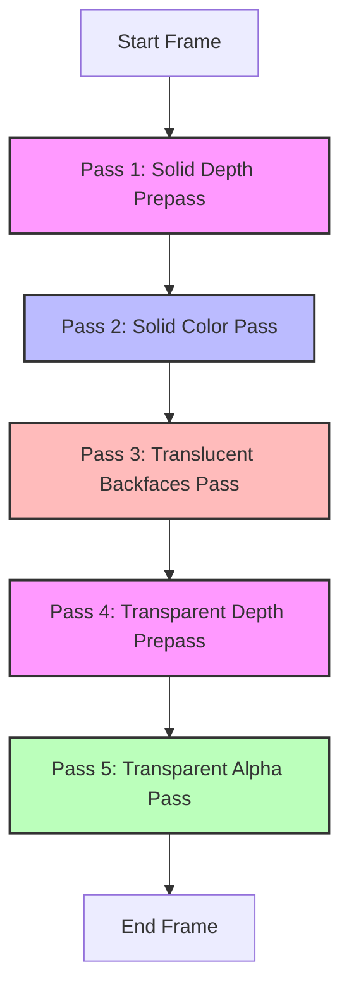

# Thraxblox

Thraxblox is a high-performance, modular voxel rendering and world management library built on top of [Three.js](https://threejs.org/) and WebGL2. It focuses on memory-efficient representation, minimal draw calls, and solving translucency/transparency sorting challenges in block-based environments.

**[🎮 Live Demo](https://manthrax.github.io/thraxblox/)**

---

## Key Features & Architecture

### 1. Vertical Run-Length Encoding (RLE)
Rather than representing voxels in a 3D grid array, Thraxblox represents chunks as columns of vertically stored runs via [RLEColumn](src/world/RLEColumn.js).
* **Memory Optimization:** Reduces memory footprint significantly compared to traditional uncompressed 3D arrays.
* **Continuous Vertical Runs:** Multiple vertical layers of the same block type are compressed into a single run entry containing the block type and height.

### 2. GPU Instanced Runs
Instead of drawing single voxels as individual meshes or generating complex, static merged geometry for whole chunks, Thraxblox renders the world using WebGL instanced drawing.
* **Draw Call Minimization:** All solid block runs in a chunk are rendered with a single instanced mesh; similarly, all transparent/translucent runs are rendered with another.
* **Dynamic Scaling:** A standard `BoxGeometry` representing a unit cube is stretched vertically on the GPU (via the instance height attribute) to match the vertical run length, allowing a single instanced geometry to represent columns of any height.

### 3. Bitwise Face-Occlusion Culling
To prevent rendering internal faces, Thraxblox evaluates adjacent columns to determine which faces are visible.
* **Occlusion Masking:** Run intersections are calculated on the CPU to create a bitmask (stored in the `a_instanceFaces` attribute) for the 6 cube faces (+X, -X, +Y, -Y, +Z, -Z).
* **Vertex-Shader Culling:** The vertex shader reads this mask. If a face is marked as occluded, the vertex coordinates are collapsed to zero, avoiding rasterization and pixel shading of hidden polygons.

### 4. Custom Voxel Shader & Dynamic Texturing
A unified WebGL2 shader ([voxelShader.js](src/render/voxelShader.js)) handles texture application, animation, and color tinting.
* **World-Aligned UV Mapping:** Standard UV coordinate maps are not required. The fragment shader dynamically determines the face being rendered using the vertex normal and maps the texture from a 2D atlas using the block's world coordinates.
* **Animations:** Supports texture offset shifting over time (e.g., for flowing water textures).
* **Foliage Color Tinting:** Allows applying dynamic color shifts to specific block types (e.g., grass, leaves) based on coordinate inputs and customized uniform colors.

### 5. 3-Phase / 5-Pass Layered Renderer
Handling translucency (e.g., water) alongside solid geometry is a common challenge in voxel renderers due to back-to-front sorting requirements. Thraxblox implements a custom rendering loop in [EngineAPI.js](src/api/EngineAPI.js) to resolve this:



* **Pass 1: Solid Depth Prepass (Layer 0)** – Renders solid geometry writing only to the depth buffer (`colorWrite: false`), optimizing hardware early-Z rejection.
* **Pass 2: Solid Color Pass (Layer 0)** – Renders solid color outputs with `depthWrite` disabled and `depthFunc: EqualDepth`.
* **Pass 3: Translucent Backfaces Pass (Layer 1)** – Renders the backfaces of translucent objects (`side: BackSide`, `depthFunc: EqualDepth` or `LessEqualDepth`) to ensure inner water/translucent boundaries are visible.
* **Pass 4: Transparent Depth Prepass (Layer 1)** – Performs a depth-only prepass for transparent/translucent geometries.
* **Pass 5: Transparent Alpha Pass (Layer 1)** – Renders transparent geometry front-faces with alpha blending and `depthFunc: LessEqualDepth`.

---

## API Reference

### Initialization
```javascript
import { createRenderSystem } from './src/render/RenderSystem.js';
import { EngineAPI } from './src/api/EngineAPI.js';

// Setup basic Three.js scene components
const { scene, camera, renderer } = createRenderSystem();

// Instantiate Engine API
const engine = new EngineAPI(scene, camera, renderer);
await engine.init();
```

### World Interaction
* **`engine.getBlock(x, y, z)`**: Returns the block ID at the given integer coordinate.
* **`engine.setBlock(x, y, z, type)`**: Sets the block at the specified coordinate to `type`. Returns `true` if changed.
* **`engine.fillBlocks(x1, y1, z1, x2, y2, z2, type)`**: Fills a 3D bounding box with the specified block type.
* **`engine.raycast(start, direction, maxDistance)`**: Casts a ray through the voxel grid. Returns a hit result containing:
  ```javascript
  {
      hit: boolean,
      x: number, y: number, z: number,       // Hit block coordinates
      normal: THREE.Vector3,                 // Face normal
      placeX: number, placeY: number, placeZ: number // Adjacent empty position
  }
  ```

### Block Behaviors
You can register lifecycle callbacks for custom block types:
```javascript
engine.registerBlockBehavior(BLOCK_IDS.DIRT, {
    onPlace: (x, y, z, type, api) => {
        console.log(`Placed dirt at ${x}, ${y}, ${z}`);
    },
    onBreak: (x, y, z, type, api) => {
        console.log(`Broke dirt at ${x}, ${y}, ${z}`);
    }
});
```

---

## License
MIT
